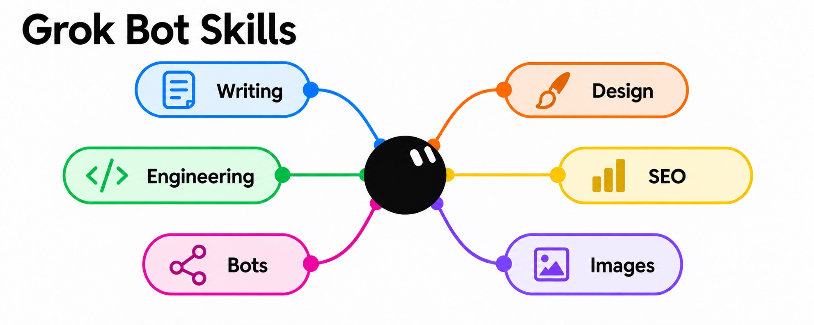

# Grok Bot Skills

22 skills for writing, design, code, SEO, images, and bot routines. Give your Grok Bot a clear process for the job you need done.

The catalog has 19 local skills and 3 upstream skills. Each uses a readable `SKILL.md` file. Pick one, read it, and adapt it to your bot.

[Start here](#start-here) · [Browse all 22 skills](#all-skills) · [Contribute](#contribute)

## Start here

| I want to… | Start with |
| --- | --- |
| Remove AI filler from a draft | [no-ai-slop](skills/writing/no-ai-slop/SKILL.md) |
| Improve a website's design | [redesign-existing-projects](skills/design/redesign-existing-projects/README.md) |
| Create a bot with one clear job | [design-a-grok-bot](skills/bots/design-a-grok-bot/SKILL.md) |
| Find noisy or wasteful routines | [routine-healthcheck](skills/bots/routine-healthcheck/SKILL.md) |
| Write a post for X or LinkedIn | [social-copywriting](skills/writing/social-copywriting/SKILL.md) |

## Get a skill

For the 19 local skills, download the [ZIP](https://github.com/coolxeo/grok-bot-skills/archive/refs/heads/main.zip), or clone the repo:

```sh
git clone https://github.com/coolxeo/grok-bot-skills.git
```

1. Open a skill from the list below. Read its instructions and tool needs.
2. Copy that skill's folder into the workflows or skills directory your bot uses. Keep its folder name and `SKILL.md` file together. Preserve source credits and applicable license notices.
3. Invoke the folder name with `/` or `@` if your bot supports it. For example, use `/no-ai-slop`.

The install path and invocation syntax depend on your bot. To try a writing skill without installing it, paste its instructions into a chat, then add your task.

### Install upstream skills

The two Taste skills and `make-bot-ui` now come from their original authors. Their catalog links lead to install instructions. They are not included in the ZIP as skill files.

You can install them directly with the [Skills CLI](https://github.com/vercel-labs/skills):

```sh
npx skills add Leonxlnx/taste-skill --skill design-taste-frontend redesign-existing-projects
npx skills add https://github.com/cursor/plugins/tree/main/pstack/skills/make-bot-ui --skill "Make Bot UI"
```

Or clone this repo and use the versions checked in our source audit:

```sh
# Preview all three commands without installing anything.
node scripts/install-upstream.mjs all --dry-run

# Install one skill. The CLI selects the destination.
node scripts/install-upstream.mjs design-taste-frontend

# Install all three into the current project for Codex.
node scripts/install-upstream.mjs all -- --agent codex --yes
```

The script needs Node.js 22 or newer, npm, Git, and network access. It runs Skills CLI 1.6.0 with the source commits in [upstream-skills.json](upstream-skills.json). It installs into the directory where you run it. Add `-- --global` only if you want a user-wide install. To install into another project, run the script by its absolute path from that project.

These commands download local files from upstream. They do not create a live remote dependency. The direct commands follow the upstream branch; the script uses fixed commits. Update the manifest to adopt a newer audited version. A link in `SKILL.md` alone does not install another skill.

The CLI supports agents such as Codex and Claude Code. Grok Bot installation through this CLI has not been verified. For Grok Bot, use its supported import process and include the skill's companion files. Tool access still depends on the bot environment.

Keep the local writing adaptations if you want the workflows in this catalog. The full upstream writing pack also needs its setup, context, and template files.

### Try it

After you load `no-ai-slop`:

```text
Edit this paragraph. Keep the meaning and my voice. Remove filler.

Our innovative platform leverages cutting-edge technology to seamlessly
empower teams to unlock their full potential.
```

After you load `redesign-existing-projects`:

```text
Review this landing page. Find the three biggest design problems.
Explain each fix before changing the code. Keep the current features.
```

After you load `routine-healthcheck`:

```text
Audit my scheduled routines. Find empty runs, duplicate work, and noisy
updates. Show the evidence. Propose changes before applying them.
```

## All skills

### Writing

| Skill | What it does |
| --- | --- |
| [coach](skills/writing/coach/SKILL.md) | Review a draft's argument and structure before line edits. |
| [outline](skills/writing/outline/SKILL.md) | Turn notes or an idea into an article plan. |
| [draft](skills/writing/draft/SKILL.md) | Write an article one section at a time. |
| [source-check](skills/writing/source-check/SKILL.md) | Check factual claims against named sources. |
| [no-ai-slop](skills/writing/no-ai-slop/SKILL.md) | Remove AI writing patterns while keeping the writer's voice. |
| [top-edit](skills/writing/top-edit/SKILL.md) | Flag style issues in a final editorial pass. |
| [social-copywriting](skills/writing/social-copywriting/SKILL.md) | Write or adapt posts for X and LinkedIn. |
| [x-article](skills/writing/x-article/SKILL.md) | Write long-form X Articles with section images. |

### Design

| Skill | What it does |
| --- | --- |
| [design-taste-frontend](skills/design/design-taste-frontend/README.md) | Build landing pages and portfolios from a clear design brief. |
| [redesign-existing-projects](skills/design/redesign-existing-projects/README.md) | Audit and improve an existing site's design. |
| [diagram-design](skills/design/diagram-design/SKILL.md) | Create explainer diagrams with the upstream diagram pack. |

### Engineering

| Skill | What it does |
| --- | --- |
| [engineering-playbook](skills/engineering/engineering-playbook/SKILL.md) | Delegate coding work to cloud agents and review the results. |
| [show-me](skills/engineering/show-me/SKILL.md) | Explain code changes with visual PR descriptions. |

### SEO

| Skill | What it does |
| --- | --- |
| [aeo-geo-site](skills/seo/aeo-geo-site/SKILL.md) | Structure site content for search and AI-assisted discovery. |
| [exact-match-intent-seo](skills/seo/exact-match-intent-seo/SKILL.md) | Match domains, page titles, and URLs to search intent. |

### Bots

| Skill | What it does |
| --- | --- |
| [design-a-grok-bot](skills/bots/design-a-grok-bot/SKILL.md) | Define a bot's job, voice, and wake conditions. |
| [make-bot-ui](skills/bots/make-bot-ui/README.md) | Build a custom UI that calls a bot through a webhook. |
| [routine-healthcheck](skills/bots/routine-healthcheck/SKILL.md) | Find token waste and noise in scheduled routines. |
| [transcript-healthcheck](skills/bots/transcript-healthcheck/SKILL.md) | Find repeated friction in bot transcripts. |
| [overheard](skills/bots/overheard/SKILL.md) | Compile a digest of third-party mentions. |
| [overheard-setup](skills/bots/overheard-setup/SKILL.md) | Set up a mention watch list, sources, and schedule. |

### Images

| Skill | What it does |
| --- | --- |
| [chatgpt-images-browser-playbook](skills/images/chatgpt-images-browser-playbook/SKILL.md) | Generate still images through a signed-in ChatGPT browser session. |

## Tool requirements

The instructions are plain Markdown. Some workflows need more than a chat window:

- Bot and engineering skills refer to Grok Bot tools, routines, cloud agents, or local agent data. Check that your environment has those tools before running them.
- Some coding workflows refer to pstack skills. Install that pack separately when a workflow needs it.
- `diagram-design` needs the [upstream diagram pack](https://github.com/cathrynlavery/diagram-design), including its reference files.
- The image playbook needs browser control and a signed-in ChatGPT session with image generation available.
- Search, publishing, and design tasks need the relevant browser, connector, or project access.

Other agents may need changes to tool names, paths, or invocation syntax. Cross-agent compatibility has not been verified.

## Contribute

Found a useful improvement? Open an [issue](https://github.com/coolxeo/grok-bot-skills/issues) or a pull request.

Keep each skill focused on one job. Use `skills/<category>/<slug>/SKILL.md` with `name` and `description` in YAML frontmatter. Include an example task and any tool requirements in your pull request. Add new skills to the list above. Preserve source credits and license notices.

## Inspired by

This collection links to upstream skills and includes adaptations and workflows shaped by these creators. Credit belongs to the original authors.

- [Lauren Tan (@poteto)](https://github.com/poteto): [pstack](https://github.com/cursor/plugins/tree/main/pstack), including `make-bot-ui` and `poteto-mode`; and [dr eggbot](https://x.ai/bot/marketplace/bots/dr-eggbot-v2), which matches the bot design and healthcheck workflows.
- [Lingxi Li](https://x.ai/bot/guides/grok-bot-for-engineering): [Lingxi's Engineer Bot](https://x.ai/bot/marketplace/bots/engineer-bot), which matches the engineering playbook.
- [Lenny Rachitsky](https://x.ai/bot/marketplace/bots/overheard): Overheard, which matches the mention digest and setup workflows.
- [Leon Lin / Leonxlnx](https://github.com/Leonxlnx/taste-skill): Taste Skill. Both frontend design skills now install from this source. The former bundled copies matched it exactly.
- [Nadiem Mahmoud](https://github.com/nadiem99/claude-writing-skills): the coach, outline, draft, source-check, and top-edit adaptations. His sources include Every's Eleanor Warnock and Kate Lee.
- [Peter Yang](https://github.com/petergyang/no-ai-slop): `no-ai-slop`.
- [Jules Sauvajol](https://github.com/judicael-s/Copywriting-skill): `social-copywriting` and its format, hook, and voice references.
- [HumanLayer](https://github.com/humanlayer/skills/tree/main/plugins/show-me): `show-me`. [Dexter Horthy's launch article](https://www.humanlayer.com/blog/show-me-skill) also credits Dillon Mulroy and Matt Pocock as influences.
- [Cathryn Lavery](https://github.com/cathrynlavery/diagram-design): `diagram-design` and its required reference pack.
- [Microsoft Advertising](https://about.ads.microsoft.com/content/dam/sites/msa-about/global/common/content-lib/pdf/from-discovery-to-influence-a-guide-to-aeo-and-geo.pdf): the AEO/GEO guide by Jennifer Myers, with Paul Longo as executive sponsor; plus [Alex Groberman's summary](https://www.linkedin.com/pulse/new-microsoft-just-revealed-how-get-traffic-from-alex-groberman-5af0c), used as SEO reference material.
- [Hridoy Reh](https://x.com/hridoyreh/status/2096534436934455606): the recorded inspiration for `exact-match-intent-seo`. The original X post could not be reverified during this audit.

See the [source audit for all 22 skills](docs/credits.md) for exact files, evidence, and unresolved origins. No standalone upstream was verified for `x-article` or `chatgpt-images-browser-playbook`.

## License

Original contributions use the [MIT License](LICENSE). Third-party material retains its applicable terms and notices. See [third-party notices](THIRD_PARTY_NOTICES.md); the matched marketplace templates do not have a verified MIT grant.

This is a community project. It is not affiliated with xAI or Cursor. Credits do not imply endorsement.
