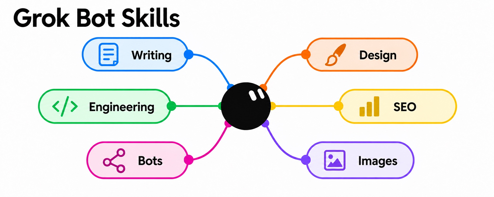

# Grok Bot Skills

Free skills that run my 3 YouTube channels with a team of Grok Bots. Nothing posts or spends without my tap. The paid kits are the tested, ready-to-run versions. ↓

## Paid kits

| Kit (result name) | What it is | Price | Link | Free skill |
| --- | --- | --- | --- | --- |
| Audit your site for AI answers, then fix it | AEO/GEO Site Audit & Build Kit | €9 | [Get the kit →](https://daniacostaai.gumroad.com/l/cxabi) | [aeo-geo-site](skills/seo/aeo-geo-site/SKILL.md) |
| Make your pages and videos readable by AI answers | AEO Kit (Markdown Twins + YouTube Watch Pages) | $24 | [Get the kit →](https://daniacostaai.gumroad.com/l/wzalwo) | [markdown-twin](skills/seo/markdown-twin/SKILL.md) |
| Turn one video into Shorts, QA included | Shorts Builder Kit | $14 | [Get the kit →](https://daniacostaai.gumroad.com/l/ommvol) | [shorts-reframe](skills/video/shorts-reframe/SKILL.md) |
| Turn rough notes into an X Article | X Article Writer | €7 | [Get the kit →](https://daniacostaai.gumroad.com/l/lzowtl) | [x-article](skills/writing/x-article/SKILL.md) |

Made by Dani Acosta. Follow on X: [@DaniAcostaAI](https://x.com/DaniAcostaAI)

29 skills for writing, design, code, SEO, ads, YouTube research, video, images, and bot routines. Give your Grok Bot a clear process for the job you need done.

Every skill is Dani's own version, inspired by several public references rather than copied from one. Each is a single readable `SKILL.md`. The rewritten skills end with what inspired them, what those references were missing, and what this version adds.

[Start here](#start-here) · [Browse all 29 skills](#all-skills) · [Contribute](#contribute)

## Install

Install the local skills with the [Skills CLI](https://github.com/vercel-labs/skills):

```sh
npx skills add coolxeo/grok-bot-skills
```

To install one skill, add `--skill` and its folder name, for example `npx skills add coolxeo/grok-bot-skills --skill no-ai-slop`. Run `npx skills add coolxeo/grok-bot-skills --list` to see them all.

## Start here

| I want to… | Start with |
| --- | --- |
| Remove AI filler from a draft | [no-ai-slop](skills/writing/no-ai-slop/SKILL.md) |
| Improve a website's design | [redesign-existing-projects](skills/design/redesign-existing-projects/SKILL.md) |
| Create a bot with one clear job | [design-a-grok-bot](skills/bots/design-a-grok-bot/SKILL.md) |
| Find noisy or wasteful routines | [routine-healthcheck](skills/bots/routine-healthcheck/SKILL.md) |
| Write a post for X or LinkedIn | [social-copywriting](skills/writing/social-copywriting/SKILL.md) |
| Get better leads from automated ad campaigns | [whetstone-signal](skills/ads/whetstone-signal/SKILL.md) |
| Find what wins in a YouTube niche before planning videos | [youtube-niche-report](skills/youtube/youtube-niche-report/SKILL.md) |

## Get a skill

For all 29 skills, download the [ZIP](https://github.com/coolxeo/grok-bot-skills/archive/refs/heads/main.zip), or clone the repo:

```sh
git clone https://github.com/coolxeo/grok-bot-skills.git
```

1. Open a skill from the list below. Read its instructions and tool needs.
2. Copy that skill's folder into the workflows or skills directory your bot uses. Keep its folder name and `SKILL.md` file together. Preserve source credits and applicable license notices.
3. Invoke the folder name with `/` or `@` if your bot supports it. For example, use `/no-ai-slop`.

The install path and invocation syntax depend on your bot. To try a writing skill without installing it, paste its instructions into a chat, then add your task.

### Prefer the originals?

These skills credit the work that inspired them. If you want an original instead, install it from its author, for example:

```sh
npx skills add petergyang/no-ai-slop
npx skills add Leonxlnx/taste-skill --skill design-taste-frontend redesign-existing-projects
npx skills add https://github.com/cursor/plugins/tree/main/pstack/skills/make-bot-ui --skill "Make Bot UI"
```

The CLI supports agents such as Codex and Claude Code. Grok Bot installation through this CLI has not been verified. For Grok Bot, use its supported import process. Tool access still depends on the bot environment.

### Try it

After you load `no-ai-slop`:

```text
Edit this paragraph. Keep the meaning and my voice. Remove filler.

Our innovative platform leverages cutting-edge technology to seamlessly
empower teams to unlock their full potential.
```

After you load `redesign-existing-projects`:

```text
Review this landing page. Find the three biggest design problems.
Explain each fix before changing the code. Keep the current features.
```

After you load `routine-healthcheck`:

```text
Audit my scheduled routines. Find empty runs, duplicate work, and noisy
updates. Show the evidence. Propose changes before applying them.
```

## All skills

### Writing

| Skill | What it does |
| --- | --- |
| [coach](skills/writing/coach/SKILL.md) | Review a draft's argument and structure before line edits. |
| [outline](skills/writing/outline/SKILL.md) | Turn notes or an idea into an article plan. |
| [draft](skills/writing/draft/SKILL.md) | Write an article one section at a time. |
| [source-check](skills/writing/source-check/SKILL.md) | Check factual claims against named sources. |
| [no-ai-slop](skills/writing/no-ai-slop/SKILL.md) | Remove AI writing patterns while keeping the writer's voice. |
| [top-edit](skills/writing/top-edit/SKILL.md) | Flag style issues in a final editorial pass. |
| [social-copywriting](skills/writing/social-copywriting/SKILL.md) | Write or adapt posts for X and LinkedIn. |
| [x-article](skills/writing/x-article/SKILL.md) | Write long-form X Articles with section images. |
| [ship-post](skills/writing/ship-post/SKILL.md) | Turn commits and PRs into one build-in-public post. |

### Design

| Skill | What it does |
| --- | --- |
| [design-taste-frontend](skills/design/design-taste-frontend/SKILL.md) | Build landing pages and portfolios from a clear design brief. |
| [redesign-existing-projects](skills/design/redesign-existing-projects/SKILL.md) | Audit and improve an existing site's design. |
| [diagram-design](skills/design/diagram-design/SKILL.md) | Create explainer diagrams that are branded, not dashboard slop. |

### Engineering

| Skill | What it does |
| --- | --- |
| [engineering-playbook](skills/engineering/engineering-playbook/SKILL.md) | Delegate coding work to cloud agents and review the results. |
| [show-me](skills/engineering/show-me/SKILL.md) | Explain code changes with visual PR descriptions. |

### SEO

| Skill | What it does |
| --- | --- |
| [aeo-geo-site](skills/seo/aeo-geo-site/SKILL.md) | Structure site content for search and AI-assisted discovery. |
| [exact-match-intent-seo](skills/seo/exact-match-intent-seo/SKILL.md) | Match domains, page titles, and URLs to search intent. |
| [ai-search-gap-loop](skills/seo/ai-search-gap-loop/SKILL.md) | Track buyer prompts in Google and AI answers, diagnose each loss, make one change, and log the result. |
| [ai-citation-sources](skills/seo/ai-citation-sources/SKILL.md) | List the third-party sources AI answers cite and draft one action per source. |
| [markdown-twin](skills/seo/markdown-twin/SKILL.md) | Publish a clean markdown copy of one HTML page, advertise it with a link tag, and list it in /llms.txt. |

### Ads

| Skill | What it does |
| --- | --- |
| [whetstone-signal](skills/ads/whetstone-signal/SKILL.md) | Pick, score, and send back the conversion event automated ad campaigns optimize for. |

### YouTube

| Skill | What it does |
| --- | --- |
| [youtube-niche-report](skills/youtube/youtube-niche-report/SKILL.md) | Pull a niche's top videos, score them against their own channel, and build an interactive HTML report of what wins. Ships with an example config for a made-up niche. |

### Video

| Skill | What it does |
| --- | --- |
| [shorts-reframe](skills/video/shorts-reframe/SKILL.md) | Crop a 16:9 video to 9:16, scale it to 1080x1920, keep the audio, and check duration and resolution. |

### Bots

| Skill | What it does |
| --- | --- |
| [design-a-grok-bot](skills/bots/design-a-grok-bot/SKILL.md) | Define a bot's job, voice, and wake conditions. |
| [make-bot-ui](skills/bots/make-bot-ui/SKILL.md) | Build a custom UI that calls a bot through a webhook. |
| [routine-healthcheck](skills/bots/routine-healthcheck/SKILL.md) | Find token waste and noise in scheduled routines. |
| [transcript-healthcheck](skills/bots/transcript-healthcheck/SKILL.md) | Find repeated friction in bot transcripts. |
| [overheard](skills/bots/overheard/SKILL.md) | Compile a digest of third-party mentions. |
| [overheard-setup](skills/bots/overheard-setup/SKILL.md) | Set up a mention watch list, sources, and schedule. |

### Images

| Skill | What it does |
| --- | --- |
| [chatgpt-images-browser-playbook](skills/images/chatgpt-images-browser-playbook/SKILL.md) | Generate still images through a signed-in ChatGPT browser session. |

## Tool requirements

The instructions are plain Markdown. Some workflows need more than a chat window:

- Bot and engineering skills refer to Grok Bot tools, routines, cloud agents, or local agent data. Check that your environment has those tools before running them.
- Some coding workflows refer to pstack skills. Install that pack separately when a workflow needs it.
- `diagram-design` runs on its own. If [Cathryn Lavery's diagram pack](https://github.com/cathrynlavery/diagram-design) is installed, it uses that pack's type references too.
- `youtube-niche-report` runs Python scripts with yt-dlp, ffmpeg and Pillow on a machine that can reach YouTube.
- `shorts-reframe` needs ffmpeg and ffprobe on the machine that holds the source video.
- The image playbook needs browser control and a signed-in ChatGPT session with image generation available.
- Search, publishing, and design tasks need the relevant browser, connector, or project access.

Other agents may need changes to tool names, paths, or invocation syntax. Cross-agent compatibility has not been verified.

## Contribute

Found a useful improvement? Open an [issue](https://github.com/coolxeo/grok-bot-skills/issues) or a pull request.

Keep each skill focused on one job. Use `skills/<category>/<slug>/SKILL.md` with `name` and `description` in YAML frontmatter. Include an example task and any tool requirements in your pull request. Add new skills to the list above. Preserve source credits and license notices.

## Inspired by

Each skill here is written from scratch in our own words, drawing on several references. Credit for the ideas belongs to these authors. The [credits table](docs/credits.md) lists every reference with a link, what it does well, what it was missing, and what we added.

- **no-ai-slop:** inspired by [Peter Yang's no-ai-slop](https://github.com/petergyang/no-ai-slop), [Wikipedia's Signs of AI writing](https://en.wikipedia.org/wiki/Wikipedia:Signs_of_AI_writing), [blader/humanizer](https://github.com/blader/humanizer), [Hardik Pandya's stop-slop](https://github.com/hardikpandya/stop-slop), [Conor Bronsdon's avoid-ai-writing](https://github.com/conorbronsdon/avoid-ai-writing), and [Lauren Tan's pstack unslop](https://github.com/cursor/plugins/tree/main/pstack/skills/unslop).
- **coach, outline, draft, source-check, top-edit:** inspired by [Nadiem Mahmoud's claude-writing-skills](https://github.com/nadiem99/claude-writing-skills) (which credits Every's Eleanor Warnock and Kate Lee), Paul Graham's essays on writing, George Orwell's *Politics and the English Language*, Mike Caulfield's SIFT, Wikipedia's Verifiability policy, Google's technical writing course, and Hardik Pandya's stop-slop.
- **ship-post:** inspired by the ship-post reference in [Corey Haines's marketingskills](https://github.com/coreyhaines31/marketingskills).
- **social-copywriting:** inspired by [Jules Sauvajol's Copywriting-skill](https://github.com/judicael-s/Copywriting-skill), X's published ranking code (xai-org/x-algorithm, 2026) and the older heavy ranker README, and LinkedIn Engineering's dwell-time post.
- **design-taste-frontend, redesign-existing-projects:** inspired by [Leon Lin's Taste Skill](https://github.com/Leonxlnx/taste-skill), Anthropic's frontend-design skill, Vercel's Web Interface Guidelines, and Nielsen Norman Group's usability heuristics.
- **diagram-design:** inspired by [Cathryn Lavery's diagram-design](https://github.com/cathrynlavery/diagram-design), the C4 model's notation guide, and Edward Tufte's idea of chartjunk.
- **engineering-playbook:** inspired by [Lingxi Li's Engineer Bot](https://x.ai/bot/marketplace/bots/engineer-bot), Google's engineering practices on small changes, and Lauren Tan's pstack.
- **show-me:** inspired by [HumanLayer's show-me](https://github.com/humanlayer/skills/tree/main/plugins/show-me) (whose launch article credits Dillon Mulroy and Matt Pocock), Google's guide to change descriptions, and GitHub's diagram docs.
- **design-a-grok-bot, routine-healthcheck, transcript-healthcheck, make-bot-ui:** inspired by [Lauren Tan (@poteto)](https://github.com/poteto)'s [dr eggbot](https://x.ai/bot/marketplace/bots/dr-eggbot-v2) and [pstack](https://github.com/cursor/plugins/tree/main/pstack), Anthropic's *Building effective agents*, the Google SRE book, Hamel Husain's field guide, Tailscale's Serve docs, and GitHub's webhook docs.
- **overheard, overheard-setup:** inspired by [Lenny Rachitsky's Overheard](https://x.ai/bot/marketplace/bots/overheard), F5Bot, and Google Alerts.
- **aeo-geo-site:** built on [Microsoft Advertising's AEO/GEO guide](https://about.ads.microsoft.com/content/dam/sites/msa-about/global/common/content-lib/pdf/from-discovery-to-influence-a-guide-to-aeo-and-geo.pdf) by Jennifer Myers and [Alex Groberman's summary](https://www.linkedin.com/pulse/new-microsoft-just-revealed-how-get-traffic-from-alex-groberman-5af0c).
- **exact-match-intent-seo:** started from [Hridoy Reh's X post](https://x.com/hridoyreh/status/2096534436934455606), not reverified.
- **markdown-twin:** inspired by [Jeremy Howard / llmstxt.org](https://llmstxt.org/): the /llms.txt v2 proposal.
- **shorts-reframe:** inspired by [FFmpeg crop filter documentation](https://ffmpeg.org/ffmpeg-filters.html#crop) and the [mediacodec.dev crop guide](https://mediacodec.dev/how-to/crop-video/).
- **x-article, chatgpt-images-browser-playbook:** Dani's own workflows; no outside source verified.

See the [source audit of the 22 skills reviewed on 17 Sep 2026](docs/credits.md) for exact files, evidence, and unresolved origins. No standalone upstream was verified for `x-article` or `chatgpt-images-browser-playbook`.

## License

This collection uses the [MIT License](LICENSE). The skills are written in our own words; no text is copied from the references. License notices for the open-source projects that inspired them are kept in [third-party notices](THIRD_PARTY_NOTICES.md) as attribution. Marketplace templates showed no reuse license, so nothing from them is reproduced.

This is a community project. It is not affiliated with xAI or Cursor. Credits do not imply endorsement.

Follow [@DaniAcostaAI](https://x.com/DaniAcostaAI) on X for updates and new skills.
