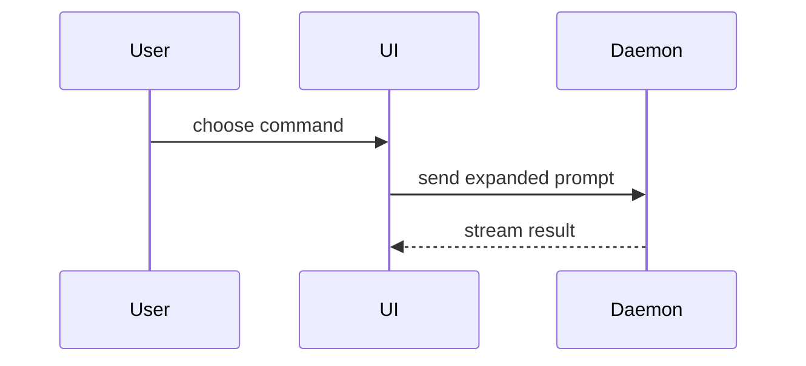

# show-me

Source: adapted from [HumanLayer, show-me](https://github.com/humanlayer/skills/blob/3c2629142c5d437428269b1b722b08c0b87f574d/plugins/show-me/skills/show-me/SKILL.md). [Dexter Horthy's launch article](https://www.humanlayer.com/blog/show-me-skill) credits Dillon Mulroy and Matt Pocock as influences. MIT; see [third-party notices](../../../THIRD_PARTY_NOTICES.md).

Help the reader understand the change visually. Skip the preamble. Keep prose brief. Pick the **smallest** view that makes the key point clear. Prefer putting these visuals **in the PR body** next to the short text they support.

## When opening a PR

1. Write Why / What / How to verify in short prose (or fill the repo template).
2. Add one or more show-me blocks so a reviewer can scan shape without reading the whole diff first: a file-tree diff, a call-tree diff, a component-tree diff, a state/control-flow diff, or a Mermaid sequence — whichever matches the change.
3. Do not dump every format. One or two well-chosen views beat a collage.
4. Every claim in a visual must match the real diff. No invented paths or symbols.
5. Redact secrets. Prefer public-safe labels.

## Toolbox

- **Logic / algorithm** as pseudocode:

```text
on(save)
  if content is unchanged
    return cached result
  write new content
  return fresh result
```

- **Runtime control flow** as a call tree:

```text
submitForm
  createSession
    persistPrompt
    launchAgent
  navigateToSession
```

- **UI structure** as a component tree (include state and module boundaries that matter):

```tsx
<SessionPage> (apps/example/src/routes/session.tsx)
  useSessionEvents()
  <SessionToolbar>
    <RunSkillButton> (packages/ui)
```

- **File responsibility** or a broad refactor as a shallow file tree:

```text
src/
├── commands/       # parses user actions
├── sessions/       # owns session state
└── transport/      # sends API requests
```

- **Interaction / data flow** with Mermaid:



- Use **`diff`** when the point is what changes and the surrounding shape already exists. Match the diff shape to the topic.

Component change:

```diff
 <SessionPage>
   useSessionEvents()
   <SessionToolbar>
+    <RunSkillButton />
   <SessionTimeline>
+    <SkillResultCard />
```

File-layout change:

```diff
 src/
 ├── commands/
+│   └── show-me.ts
 ├── sessions/
-└── transport.ts
+└── transport/
+    ├── client.ts
+    └── stream.ts
```

Call-tree change:

```diff
 submitForm
   createSession
     persistPrompt
+    expandSkillMention
     launchAgent
-  navigateToSession
+  navigateToSession
+    subscribeToEvents
```

State / control-flow change:

```diff
 on(save)
-  write content
+  if content is unchanged
+    return cached result
+  write new content
+  invalidate cache
```

- Show the **whole block** when most of it is new, when omitted context would hide ownership or order, or when the reader needs a copyable target shape.

- For a visual UI, layout, state comparison, or concept too dense for Mermaid, write one focused HTML file under `/workspace` (diagram, infographic, or short slide). Match the product's colors, type, and spacing when known. Attach or link it; do not invent a `Bash(open …)` path on this assistant.

## Guidance

Place each visual next to the short text it supports. Keep only the calls, files, props, states, and boundaries needed for the current question.

You may use one of these, or several. It is unlikely you will use all of them. Do not overwhelm the reader.
